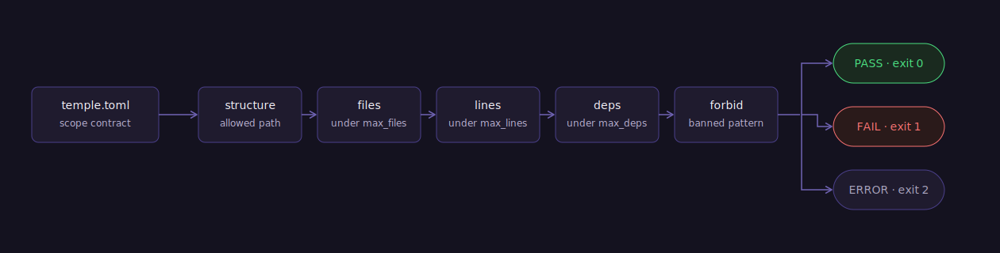
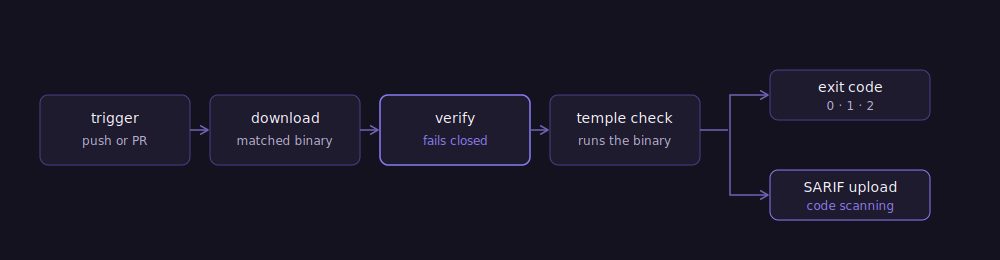

<p align="center">
  
</p>

# temple

**Fail the build when a repo drifts past its declared single-purpose scope.**

A _temple_ is the stretcher on a loom that holds woven cloth to a constant width so it can't "draw in" and distort. This tool does the same for a repository: you declare the shape, and temple keeps it from drawing in.

temple checks **scope width** — not code quality, not security, not style. You write a short contract that says what this repo is *allowed* to be, and temple fails CI the moment a change breaches it. It turns "one small addition" — the way single-purpose tools quietly become frameworks — into an explicit decision you have to make on purpose.

A static Go binary, zero runtime dependencies, one TOML file.

---

## The contract

Drop a `temple.toml` at the repo root:

```toml
[scope]
purpose = "One sentence. What this repo is, and nothing else."

# Every git-tracked file must match at least one of these globs.
allow = ["src/**", "tests/**", "*.md", "*.toml", "LICENSE"]

# Hard budgets (all optional).
max_files = 40      # tracked-file ceiling
max_lines = 2000    # source-line budget (counted extensions only)
max_deps  = 3       # third-party dependency ceiling

# The "does NOT do" list — enforced, not just documented.
# Entries are regexes, matched line-by-line against source files.
forbid = ["import requests", "TODO: framework"]

# Optional knobs:
# deps_from = "go.mod"                  # where to read deps (default: auto-detect)
# count_ext = [".py", ".go", ".rs"]     # which files count toward lines/forbid
```

If a budget is declared and temple can't find a manifest to measure it against, that's
a failure — not a silent pass. A check that couldn't run is not a check that passed.

## Run it

```bash
temple check                    # once installed — see Install, below
temple check --format json      # machine-readable output
temple check --format sarif     # SARIF 2.1.0 for GitHub code scanning
temple check --root path/to/repo --config path/to/temple.toml
```

Example output:

```
temple — scope contract check
  purpose: Fail the build when a repo drifts past its declared single-purpose scope. Nothing more.
  files:        11 / 20
  source lines: 638 / 700
  deps:         2 / 3

  PASS — repo is within scope.
```

## What it checks

<p align="center">
  
</p>

1. **structure** — every git-tracked file matches an `allow` glob (`**`, `*`, `?` supported). Anything outside is drift.
2. **files** — tracked-file count stays under `max_files`.
3. **lines** — total source lines (counted extensions) stay under `max_lines`.
4. **deps** — declared third-party dependencies stay under `max_deps`. Reads `go.mod` (direct requires; `// indirect` doesn't count), `pyproject.toml`, or `requirements.txt` — whichever is found first, or the one named by `deps_from`. A declared ceiling with no manifest temple can parse is a finding, not a pass.
5. **forbid** — no forbidden pattern appears in source, reported as `file:line`.

File discovery uses `git ls-files` (so it honors `.gitignore`), falling back to a filtered walk outside a git repo.

## Exit codes

| code | meaning |
|-----:|---------|
| `0`  | in scope — pass |
| `1`  | scope breach — fail |
| `2`  | could not evaluate (missing or invalid `temple.toml`) |

## GitHub Action

```yaml
# .github/workflows/scope.yml
name: scope
on: [push, pull_request]
jobs:
  temple:
    runs-on: ubuntu-latest
    steps:
      - uses: actions/checkout@v4
      - uses: goweft/temple@v0   # moving major tag — always the latest release
```

The action downloads the platform-matched release binary, verifies it against that
release's `checksums.txt` before running anything, and installs to a scratch directory
rather than your checkout. No runtime dependency — not Python, not Go — needs to be on
the runner already.

Inputs, all optional:

| input | default | meaning |
|---|---|---|
| `version` | the release this action ships with | a tag (`v0.3.1`), a bare version (`0.3.1`), or `latest`. Pinning the action pins the binary; `latest` is resolved at run time and is not reproducible. |
| `github-token` | `${{ github.token }}` | used only to resolve `latest`; unauthenticated lookups are rate-limited on shared runner IPs. |
| `config` | `temple.toml` | path to the scope contract. |
| `root` | `.` | repo root to inspect. |
| `format` | `text` | `text`, `json`, or `sarif`. |

<p align="center">
  
</p>

## GitHub code scanning (SARIF)

`--format sarif` emits SARIF 2.1.0, which GitHub renders as code-scanning alerts and inline PR annotations. Findings that name a file (`structure`, `forbid`) point at `file:line`; repo-level findings (`files`, `lines`, `deps`) anchor to `temple.toml` — the place you'd change the budget. Each result carries a stable fingerprint so alerts track across commits instead of re-firing.

```yaml
# .github/workflows/scope.yml
name: scope
on: [push, pull_request]
permissions:
  contents: read
  security-events: write        # required to upload SARIF
jobs:
  temple:
    runs-on: ubuntu-latest
    steps:
      - uses: actions/checkout@v4
      - name: temple scope check (SARIF)
        id: temple
        uses: goweft/temple@v0
        with:
          format: sarif
        continue-on-error: true          # upload the report even on breach
      - name: upload to code scanning
        if: always()
        uses: github/codeql-action/upload-sarif@v3
        with:
          sarif_file: temple.sarif
      - name: enforce scope
        if: steps.temple.outcome == 'failure'
        run: exit 1                        # fail the check after the report is filed
```

Run temple at the repo root (the default) so SARIF paths resolve against your files. Requires a `temple.toml`: with no contract, temple exits `2` and writes nothing to upload.

## Install

**GitHub Actions:** see above — nothing to install, the action handles it.

**Locally**, download the platform binary from a [release](https://github.com/goweft/temple/releases) and verify it against the release's `checksums.txt`:

```bash
VERSION=0.3.1
OS=linux        # or darwin; windows ships a .zip
ARCH=amd64      # or arm64
ASSET="temple_${VERSION}_${OS}_${ARCH}.tar.gz"
curl -sSfL -o "$ASSET" "https://github.com/goweft/temple/releases/download/v${VERSION}/${ASSET}"
curl -sSfL -o checksums.txt "https://github.com/goweft/temple/releases/download/v${VERSION}/checksums.txt"
sha256sum --ignore-missing -c checksums.txt   # matches by filename -- keep the asset's original name
tar xzf "$ASSET" temple
```

Or, with a Go toolchain:

```bash
go install github.com/goweft/temple/cmd/temple@v0.3.1
```

## Scope (temple's own "does NOT do")

temple deliberately does **not**:

- lint code quality, format, or type-check — that's your existing tools' job;
- scan for security issues — that's the rest of the [goweft](https://github.com/goweft) suite;
- count dependencies outside `go.mod`, `pyproject.toml`, and `requirements.txt` — no Rust or npm manifests yet;
- rewrite anything — temple only reports and sets an exit code.

temple ships with its own `temple.toml` and checks itself in CI. It practices what it enforces.

## Roadmap

Shipped in **v0.2.0**: `--format sarif` for GitHub code-scanning annotations — the security-positioned distribution move. (It cost ~180 source lines, so temple's own `max_lines` budget was raised on purpose in the same change; the bump is a documented line in `temple.toml`, not silent drift.)

Shipped in **v0.3.0**: ported to Go — a static, zero-runtime binary distributed via `goreleaser`, so the GitHub Action no longer needs Python on the runner.

Shipped in **v0.3.1**: the deps check now reads `go.mod` (the Python-only port had quietly gone blind to its own dependency, and `max_deps` sat unenforced); `checkDeps` fails closed on a declared ceiling with no parseable manifest, instead of passing silently; the GitHub Action verifies release checksums before running anything it downloads.

Deliberately still not in temple:

- `exclude` globs, so the `forbid` scan can skip test fixtures and vendored code (temple's own first dogfood flagged a forbidden literal in a test fixture — this is the clean fix, made on purpose rather than mid-build);
- dependency counting for Rust / npm manifests;
- a `temple init` that writes a starter contract;
- signed release artifacts — checksums verify integrity, not provenance.

Each of these is a real addition, so each gets made on purpose — not smuggled in.

## License

Apache-2.0.
